# TTC Bus & Subway Delay Analysis (2022–2026)

End-to-end analysis of TTC delay incidents from January 2022 to January 2026, covering data cleaning, exploratory data analysis, weather integration, feature engineering, and XGBoost binary classification predicting whether an incident results in a delay of 5 minutes or more.  

[See Power BI Dashboards](#power-bi-dashboards)  

**Data source:** [Toronto Open Data — TTC Delay Data](https://open.toronto.ca/dataset/ttc-bus-delay-data/)

---

## Table of Contents
- [Project Overview](#project-overview)
- [Subway Analysis](#subway-analysis)
  - [Data Loading & Combining](#subway-data-loading--combining)
  - [Data Cleaning](#subway-data-cleaning)
  - [EDA](#subway-eda)
  - [Weather](#subway-weather)
  - [Feature Engineering](#subway-feature-engineering)
  - [Modelling](#subway-modelling)
- [Bus Analysis](#bus-analysis)
  - [Data Loading & Combining](#bus-data-loading--combining)
  - [Data Cleaning](#bus-data-cleaning)
  - [EDA](#bus-eda)
  - [Weather](#bus-weather)
  - [Feature Engineering](#bus-feature-engineering)
  - [Modelling](#bus-modelling)
- [Findings](#findings)
- [Modelling Notes](#modelling-notes)
- [Power BI Dashboards](#power-bi-dashboards)
- [Tools Used](#tools-used)

---

## Project Overview

Each row in the dataset is a **single reported delay incident**, not a single trip. When a TTC vehicle is delayed, an operator logs it and that entry becomes one row. The total number of trips operated is not in this data, so percentage-of-rides statements cannot be made. Rows where `Min Delay = 0` are not errors — they are real logged events where no measurable delay to service resulted (e.g. a passenger assist that resolved before the vehicle was held). These zero-delay rows slightly inflate incident counts and deflate average delay figures.

| | Subway | Bus |
|---|---|---|
| Cleaned rows | 94,626 | 240,614 |
| Date range | Jan 2022 – Jan 2026 | Jan 2022 – Jan 2026 |
| Zero-delay rate | 62.3% | 8.5% |
| Max recorded delay | 900 min | 999 min |

Note that the 900-min and 999-min extremes are real events, not data errors. The 900-min subway delay was caused by the February 2026 winter storm. The 999-min bus delays correspond to all-day route diversions from major events (Scotiabank Arena, Rogers Centre, TIFF, Eglinton Crosstown LRT construction). Both are handled by the `Is_Outlier` flag in the Power BI export.

---

## Subway Analysis

### Subway Data Loading & Combining

The subway data came from four separate files: three XLSX files covering 2022, 2023, and 2024, and one CSV covering 2025 onward. The 2025+ CSV contained an extra `_id` column that was dropped before combining. All four files were concatenated into a single dataframe of **97,502 raw rows** spanning January 2022 to January 2026.

### Subway Data Cleaning

**Issues encountered and how they were resolved:**

**Line 3 (SRT) discontinued**  
The Scarborough RT was shut down in 2023. All rows with `Line = "SRT"` were dropped, removing **1,932 rows**.

**Multiple inconsistent variants of the same Line value**  
The `Line` column contained dozens of different spellings for the same four lines. Examples: "YUS", "LINE 1" for the Yonge-University line; "B/D", "BD LINE 2", "BLOOR DANFORTH", "LINE 2 SHUTTLE" for Bloor-Danforth; "SHEP" for Sheppard; and over 15 variants for cross-line entries such as "YU / BD", "BD/YU", "YU & BD", "BD/ YUS", "BLOOR DANFORTH & YONGE". All variants were mapped to the four canonical values: YU, BD, SHP, and YU/BD. After normalization, rows still not matching any valid line were dropped, removing a further **216 rows**.

**Non-passenger station rows removed**  
Rows referencing TTC maintenance and operational locations that are not passenger-facing stations were identified and removed. These included Hillcrest Complex, carhouse locations, yards, shops, building and gate entries, OPS, Inglis, GO Protocol, McBrien, Gunn, and entries labelled "SUBWAY CLOSURE" or "TRACK LEVEL ACTIVITY".

**Missing Line values recovered by mapping**  
The raw data had 206 rows with a null `Line` value. These were filled by mapping each station name to its most frequently occurring Line across all other rows. All 206 were successfully resolved, leaving 0 null Line values after this step.

**Code typos**  
Three typos were identified in the delay code column: `MUNCA` was corrected to `MUNOA`, `TUNCA` to `TUNOA`, and `TRNCA` to `TRNOA`.

**Code descriptions**
After correcting typos, each code was matched against the official subway delay codes lookup file (`ttc-subway-delay-codes.xlsx`) at a **99.6% match rate**. The remaining 0.4% of unmatched codes were assigned "Unknown" and retained since their delay values are valid.

**Bound normalisation**  
All direction values outside {N, S, E, W} were set to null. The resulting null rate was **34.7%**. The column was retained in the Power BI export but excluded from model features.

After all cleaning steps the dataset contained **94,626 rows**. Line distribution:

| Line | Incidents |
|---|---|
| YU (Yonge-University) | 50,734 |
| BD (Bloor-Danforth) | 39,498 |
| SHP (Sheppard) | 3,624 |
| YU/BD (cross-line) | 1,495 |
| YU/BD/SHP | 3 |

Incidents were grouped into 7 categories:

| Category | Incidents |
|---|---|
| Other / Unknown | 46,834 |
| Passenger / Medical | 19,553 |
| Equipment / Mechanical | 8,442 |
| Operations | 7,479 |
| Security / Safety | 7,189 |
| Track / Signal / Power | 4,619 |
| Weather / Environmental | 510 |

The high "Other / Unknown" count reflects internal TTC operational codes that map to broad catch-all categories in the lookup table.

### Subway EDA

| Statistic | Value |
|---|---|
| Mean delay | 3.02 min |
| Median delay | 0 min |
| 75th percentile | 4 min |
| Max delay | 900 min |
| Zero-delay incidents | 62.3% |
| Incidents >= 5 min | 21.1% |

The median of 0 minutes reflects the 62.3% zero-delay rate. Subway incidents are logged even when no train is held — for example, ATC alerts, platform-level passenger events, and brief door issues that resolve before departure. Only 21.1% of all logged subway incidents result in a delay of 5 minutes or more.

**Timing patterns**  
Counterintuitively, the worst average delays are not during rush hour. The highest average delays occur at early morning weekday hours (4–6 AM), which is when the subway restarts after overnight maintenance. Any equipment issue or delayed maintenance run at this time cascades with no recovery buffer in the timetable. The classic rush-hour peaks (7–10 AM, 4–7 PM weekdays) have high incident counts but lower average delay per incident because the system has more capacity and faster recovery during busy periods. Sundays also show elevated delays across the day (8 AM–7 PM), driven by lower service frequency meaning each incident creates a longer gap. Weekday vs weekend average delay: 2.99 min vs 3.09 min.

**Top 5 codes account for 35.8% of all delay-minutes.**

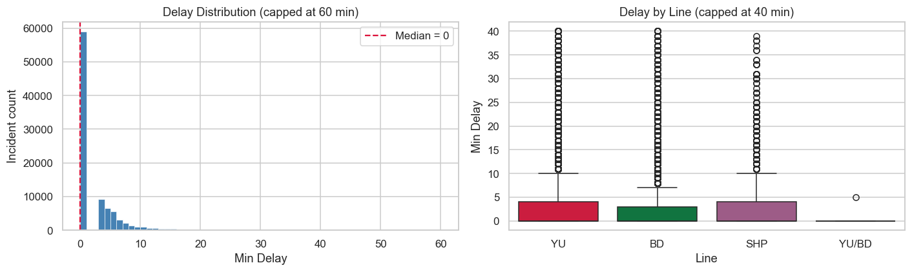

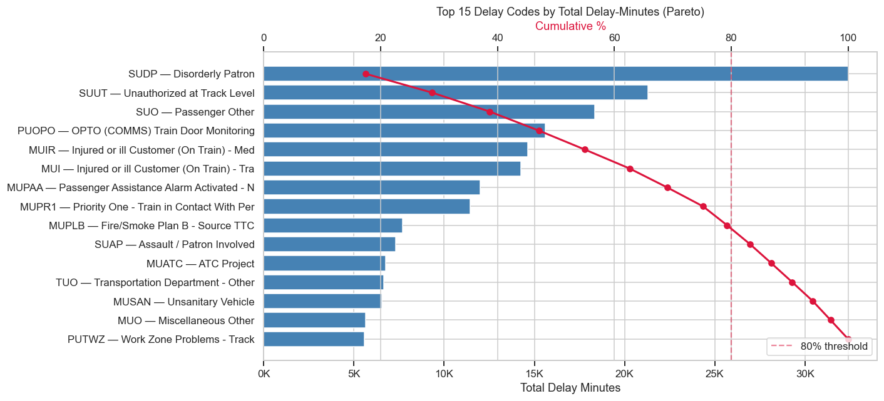

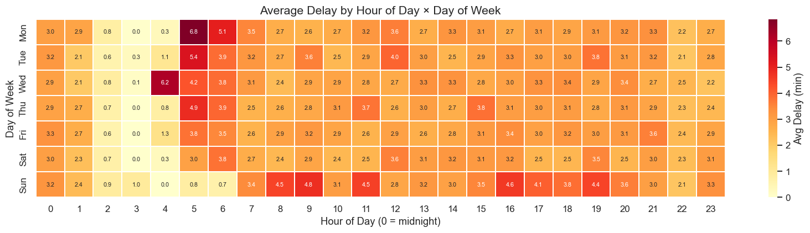

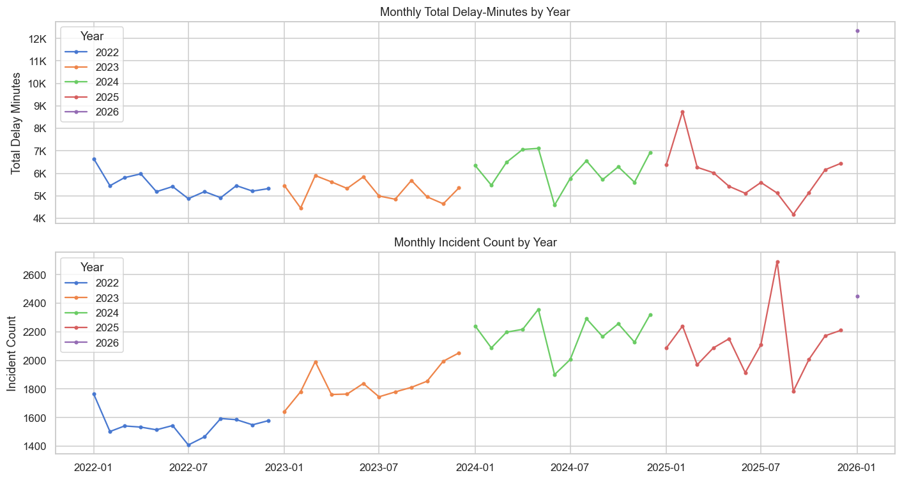

Top 10 stations by total delay-minutes:

| Station | Line | Total Delay (min) | Incidents | Avg Delay |
|---|---|---|---|---|
| Eglinton | YU | 9,744 | 1,368 | 7.1 min |
| Finch | YU | 9,085 | 1,519 | 6.0 min |
| Kipling | BD | 8,613 | 1,293 | 6.7 min |
| Kennedy BD | BD | 8,401 | 1,296 | 6.5 min |
| Bloor | YU | 7,497 | 1,126 | 6.7 min |
| Wilson | YU | 7,122 | 1,062 | 6.7 min |
| Davisville | YU | 6,088 | 763 | 8.0 min |
| Warden | BD | 5,946 | 637 | 9.3 min |
| Sheppard West | YU | 5,920 | 573 | 10.3 min |
| St George YUS | YU | 5,813 | 835 | 7.0 min |

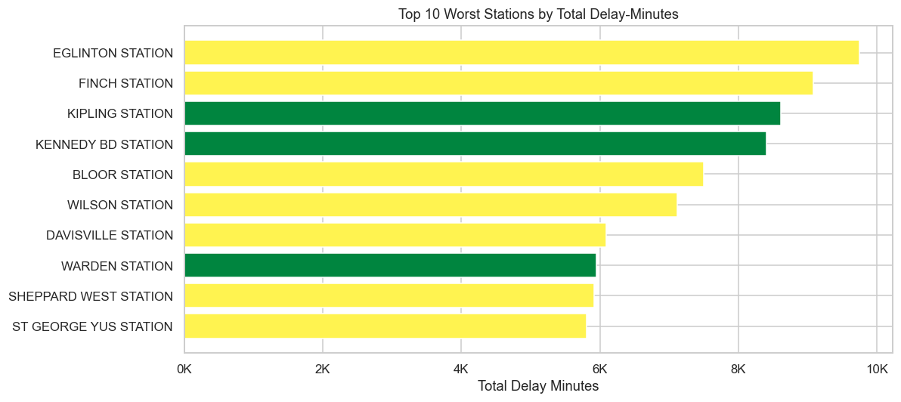

Top 10 stations by average delay (min. 20 incidents):

| Station | Line | Avg Delay | Incidents |
|---|---|---|---|
| Woodbine | BD | 13.1 min | 248 |
| Jane | BD | 11.2 min | 242 |
| Victoria Park | BD | 10.4 min | 520 |
| Sheppard West | YU | 10.3 min | 573 |
| Runnymede | BD | 10.1 min | 156 |
| Islington | BD | 10.0 min | 392 |
| Museum | YU | 9.9 min | 295 |
| Lansdowne | BD | 9.7 min | 221 |
| Old Mill | BD | 9.7 min | 238 |
| Glencairn | YU | 9.6 min | 251 |

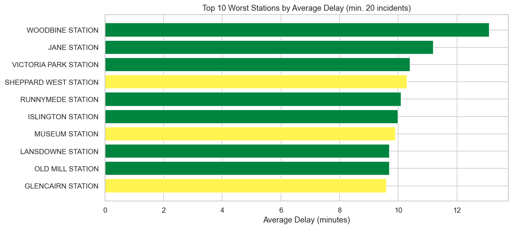

### Subway Weather

Hourly weather data for Toronto (43.6532 N, 79.3832 W) was fetched from the Open-Meteo Archive API covering January 2022 to January 2026 and cached locally as `weather_toronto.csv` (35,808 hourly rows). Each delay incident was joined to the matching hourly weather record. The weather data is loaded from the local cache on subsequent runs to avoid repeated API calls.

On the **6 heavy snow days** in the study period (avg hourly snowfall > 0.5 cm), average total daily delay across all subway stations was **1,086 minutes**, compared to **188 minutes** on the remaining 1,486 normal days — an increase of **+898 minutes (+478%)**.

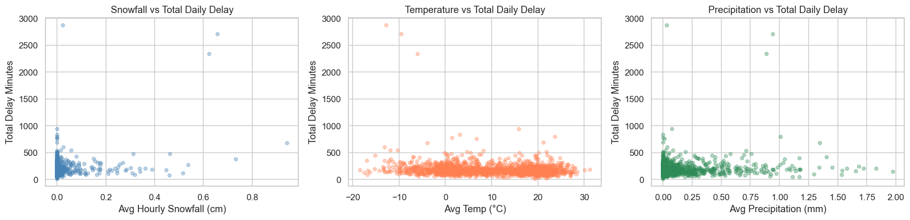

### Subway Feature Engineering

Three lag and rolling features were constructed in a leak-free manner. The dataset was sorted by `Datetime` before any feature calculation, ensuring each value at time T only uses data from before T.

| Feature | Description |
|---|---|
| `Previous_Delay` | Min Delay of the immediately preceding logged incident |
| `Rolling_Delay_5` | Rolling mean of Min Delay over the 5 incidents immediately before each row |
| `Hist_Avg_Station_Hour` | Expanding historical mean of Min Delay for the same Station and Hour combination |

### Subway Modelling

**Target:** `Delayed = 1` if `Min Delay >= 5`, else `0`

Rows where `Min Delay > 16 min` (Q3 + 3×IQR) were removed before training. The 3×IQR fence was chosen over the standard 1.5×IQR because the median is 0, meaning 1.5×IQR would flag delays around 12 minutes and remove too much valid signal. This produced `df_model` with **91,929 rows** (2,697 removed from 94,626).

Temporal split (no random shuffling — required because lag features use historical data):

| Split | Rows | Period |
|---|---|---|
| Train | 53,190 | Jan 2022 – Aug 2024 |
| Validation | 22,162 | Aug 2024 – Jul 2025 |
| Test | 13,298 | Jul 2025 – Jan 2026 |

Class balance in training: **19.8% delayed**. Most subway incidents do not produce a meaningful delay, so `scale_pos_weight` was set to account for the minority delayed class.

Model features (13): `Hour`, `Weekday`, `Weekend`, `Peak_Hour`, `Month`, `Line_enc`, `Code_enc`, `Previous_Delay`, `Rolling_Delay_5`, `Hist_Avg_Station_Hour`, `temperature_2m`, `snowfall`, `precipitation`

**Model Results (XGBoost Classifier):**

| Metric | Value |
|---|---|
| Accuracy | 0.6766 |
| ROC-AUC | 0.7941 |
| F1 (Delayed class) | 0.44 |
| Precision (Delayed) | 0.31 |
| Recall (Delayed) | 0.77 |

The model export (`subway_model_export_1.csv`) contains predictions and probabilities for **88,650 rows**.

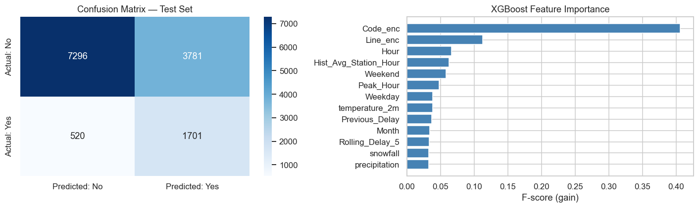

---

## Bus Analysis

### Bus Data Loading & Combining

The bus data came from four files: three XLSX files covering 2022, 2023, and 2024, and one CSV covering 2025 onward. The 2025+ CSV contained an extra `_id` column that was dropped. The two formats use fundamentally different column schemas:

| | 2022–2024 XLSX | 2025+ CSV |
|---|---|---|
| Route identifier | `Route` (integer mostly) | `Line` (string e.g. "102 MARKHAM ROAD") |
| Stop / location | `Location` (intersection name) | `Station` (stop name) |
| Incident type | `Incident` (plain English, 15 categories) | `Code` (official code e.g. "EFO", "MFSH") |
| Direction | `Direction` (N/S/E/W + junk) | `Bound` (N/S/E/W + junk) |

Raw row counts: 174,557 from the XLSX files combined, 69,037 from the 2025+ CSV.

### Bus Data Cleaning

**Issues encountered and how they were resolved:**

**Encoding errors in Bus Code Descriptions.csv**  
The lookup file mapping the 46 official bus codes to descriptions was saved with a Windows-1252 encoding error. The en-dash character (–) was double-encoded into a 3-character byte sequence (U+00E2, U+0080, U+0093). Replacing only the first visible character left two invisible control characters behind. The fix was to replace the entire 3-character sequence in one operation, correctly converting all affected descriptions to a space-dash-space separator.

**Non-service rows in XLSX**  
The `Route` column contained non-service identifiers such as "RAD" and "OTC" representing garage runs, training vehicles, and contracted operators. A leading integer was extracted from each value using a regular expression. Rows with no extractable number were dropped, removing **1,885 rows**. Column `Location` was renamed to `Stop` and `Direction` to `Bound`. Since the XLSX files do not contain official delay codes, `Code` was set to null for all 2022–2024 rows and `Description` was populated from the `Incident` column directly. `Line_Name` was set to null since route names were not included in the XLSX data.

**Non-service and cross-contaminated rows in CSV**  
The 2025+ CSV contained subway line identifiers (YU, BD, SHP, LINE 1, SRT) and internal operational labels (SHUTTLE, FLEET, TRAINING, OTC) in the `Line` column, representing data that does not belong to the bus dataset. These were identified using a regular expression and removed, dropping **244 rows**. The route number was then extracted from the Line string (e.g. 102 from "102 MARKHAM ROAD"), and rows where no number could be extracted were dropped, removing a further **851 rows**. The route name portion (e.g. "MARKHAM ROAD") was stored separately in a `Line_Name` column, which is only populated for 2025+ rows.

**Subway code leakage**  
22 rows in the 2025+ CSV carried subway-specific delay codes (MTDV, TTPD, MTO, MTNOA, MTSAN, MUO, SUDP, MTVIS, STO, MUIS, MTUS, MUIE, SRO, ETO) that do not exist in the bus lookup file. These rows were kept with their delay values intact but their descriptions were set to "Unknown".

**Bound normalisation**  
All direction values outside {N, S, E, W} were set to null. After normalisation, the null rate for `Bound` was **17.1%** (N: 55,199, S: 52,714, E: 47,336, W: 44,280). The column was kept in the Power BI export but excluded from model features.

After all cleaning and concatenation the combined dataset contained **240,614 rows** with full `Code_Category` coverage across all years.

| Category | Incidents |
|---|---|
| Mechanical | 74,698 |
| Operations | 69,795 |
| Operational Disruption | 31,476 |
| Security / Safety | 19,230 |
| Other | 17,578 |
| Emergency / Traffic | 14,620 |
| Cleaning / Sanitary | 7,919 |
| Passenger / Medical | 4,157 |
| Weather | 1,141 |

### Bus EDA

| Statistic | Value |
|---|---|
| Mean delay | 20.78 min |
| Median delay | 11.0 min |
| 75th percentile | 20 min |
| 95th percentile | 42 min |
| Max delay | 999 min |
| Zero-delay incidents | 8.5% |
| Incidents >= 5 min | 90.4% |

The mean of 20.78 minutes is nearly double the median of 11 minutes. Operations (operator availability, scheduling, late vehicles) and Mechanical (equipment failures) together account for over 55% of all incidents, making fleet reliability and operator management the two most critical pressure points in the system.

**Year-over-year trends.** Incident volume grew gradually from 2022 to 2025 (+6.4% over three full years), while average severity per incident remained stable at 20–21 minutes. Total delay-minutes reached over 1.28 million in 2025.

| Year | Incidents | Total Delay (min) | Avg Delay |
|---|---|---|---|
| 2022 | 58,301 | 1,175,292 | 20.2 min |
| 2023 | 55,466 | 1,135,136 | 20.5 min |
| 2024 | 58,905 | 1,262,674 | 21.4 min |
| 2025 | 62,021 | 1,284,498 | 20.7 min |
| 2026 (Jan only) | 5,921 | 142,988 | 24.2 min |

**Top 3 incident types account for 52.1% of all bus delay-minutes.**

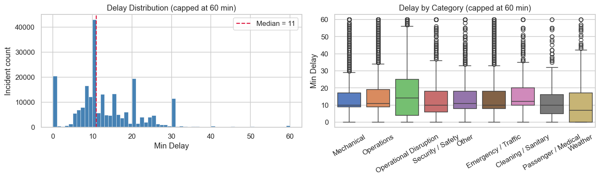

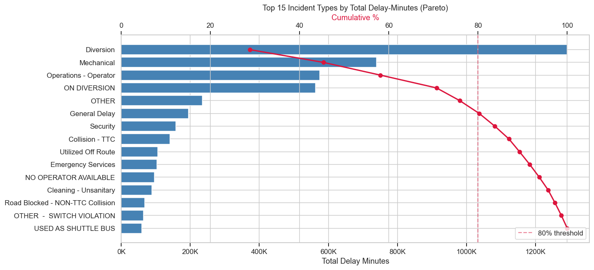

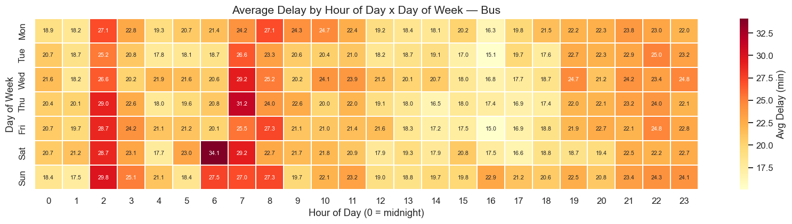

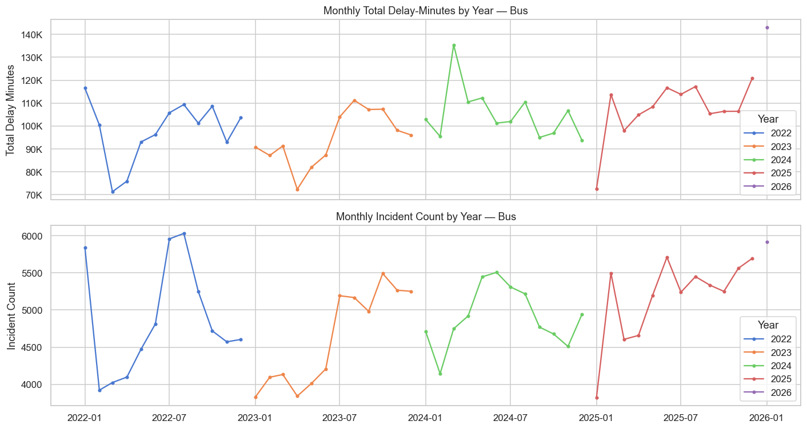

Top 10 routes by total delay-minutes:

| Route | Total Delay (min) | Incidents | Avg Delay |
|---|---|---|---|
| 52 | 125,908 | 6,071 | 20.7 min |
| 32 | 115,146 | 6,916 | 16.6 min |
| 29 | 96,012 | 4,884 | 19.7 min |
| 36 | 90,463 | 5,958 | 15.2 min |
| 97 | 87,020 | 1,813 | 48.0 min |
| 102 | 86,388 | 3,899 | 22.2 min |
| 96 | 81,940 | 3,229 | 25.4 min |
| 35 | 78,167 | 4,658 | 16.8 min |
| 54 | 75,184 | 4,095 | 18.4 min |
| 47 | 70,925 | 3,244 | 21.9 min |

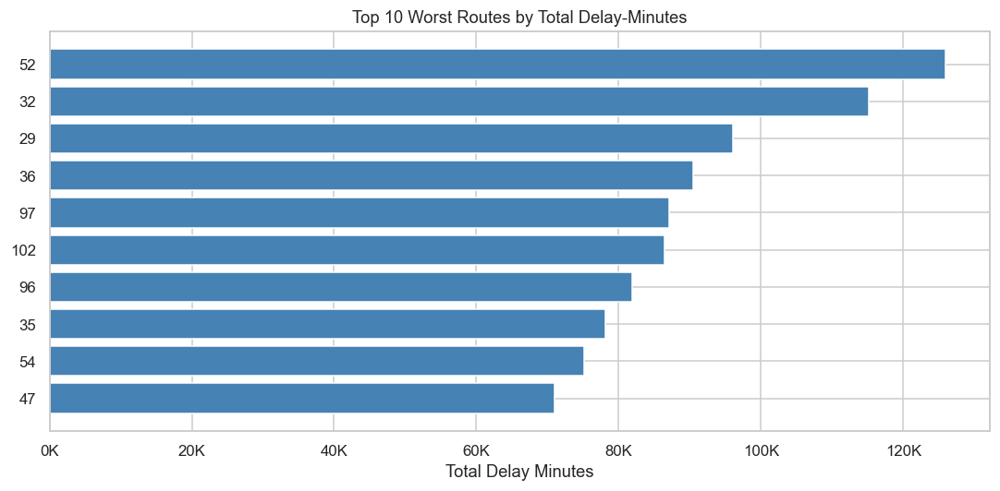

Top 10 routes by average delay (min. 50 incidents):

| Route | Avg Delay | Incidents | Total Delay (min) |
|---|---|---|---|
| 55 | 97.9 min | 217 | 21,248 |
| 77 | 96.7 min | 297 | 28,710 |
| 28 | 87.6 min | 114 | 9,984 |
| 162 | 87.4 min | 294 | 25,698 |
| 33 | 72.8 min | 282 | 20,536 |
| 82 | 72.1 min | 183 | 13,203 |
| 121 | 70.2 min | 819 | 57,528 |
| 13 | 66.3 min | 577 | 38,277 |
| 337 | 62.6 min | 68 | 4,257 |
| 202 | 61.7 min | 160 | 9,867 |

Routes 55 and 77 have extreme averages driven by diversion events. Route 77's average is ~89 min with outliers included but drops to ~16 min with them excluded — a 454% distortion. This motivated the `Is_Outlier` flag in the Power BI export.

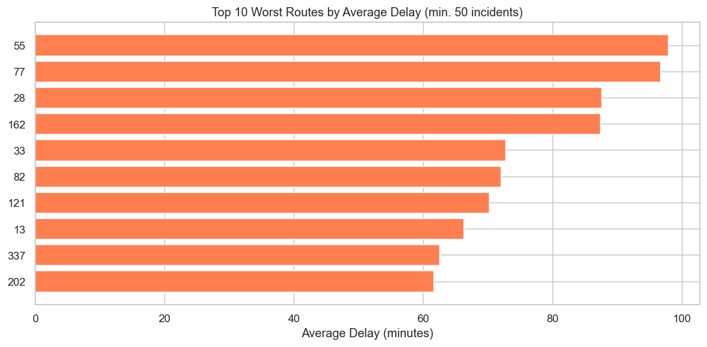

### Bus Weather

The same hourly weather cache from the subway analysis was loaded from `weather_toronto.csv`. Each delay incident was joined to the matching hourly weather record at **100% merge coverage**.

On the **9 heavy snow days** in the study period (avg hourly snowfall > 0.5 cm), average total daily delay across all bus routes was **8,023 minutes**, compared to **3,323 minutes** on the remaining 1,483 normal days — an increase of **+4,700 minutes (+141%)**.

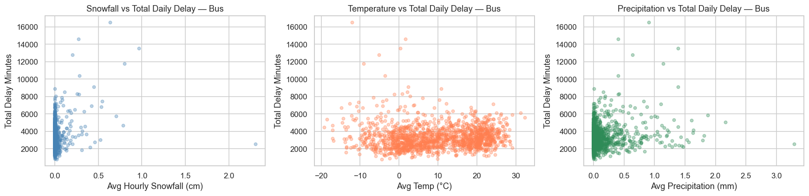

### Bus Feature Engineering

The same three lag and rolling features as subway, adapted for bus. The dataset was sorted by `Datetime` before any feature calculation.

| Feature | Description |
|---|---|
| `Previous_Delay` | Min Delay of the immediately preceding logged incident |
| `Rolling_Delay_5` | Rolling mean of Min Delay over the 5 incidents immediately before each row |
| `Hist_Avg_Route_Hour` | Expanding historical mean of Min Delay for the same Route and Hour combination |

Note: the subway version uses `Hist_Avg_Station_Hour` (grouped by Station + Hour) while the bus version uses `Hist_Avg_Route_Hour` (grouped by Route + Hour), since Route is the consistent identifier across all bus years.

### Bus Modelling

**Target:** `Delayed = 1` if `Min Delay >= 5`, else `0`

Rows where `Min Delay > 56 min` (Q3 + 3×IQR) were removed before training, producing `df_model` with **230,776 rows** (9,838 removed from 240,614). The `Is_Outlier` flag in the Power BI export uses this same 56-minute fence.

Temporal split:

| Split | Rows | Period |
|---|---|---|
| Train | 135,855 | Jan 2022 – Jul 2024 |
| Validation | 56,607 | Jul 2024 – Jul 2025 |
| Test | 33,964 | Jul 2025 – Jan 2026 |

Class balance in training: **91.7% delayed** — the inverse of subway. The large majority of logged bus incidents do result in a meaningful delay, so `scale_pos_weight` was set to account for the minority not-delayed class.

Model features (13): `Hour`, `Weekday`, `Weekend`, `Peak_Hour`, `Month`, `Route_enc`, `Category_enc`, `Previous_Delay`, `Rolling_Delay_5`, `Hist_Avg_Route_Hour`, `temperature_2m`, `snowfall`, `precipitation`

**Model Results (XGBoost Classifier):**

| Metric | Value |
|---|---|
| Accuracy | 0.7607 |
| ROC-AUC | 0.6059 |
| F1 (Delayed class) | 0.86 |
| Precision (Delayed) | 0.89 |
| Recall (Delayed) | 0.83 |

The model export (`bus_model_export_1.csv`) contains predictions and probabilities for **226,426 rows**.

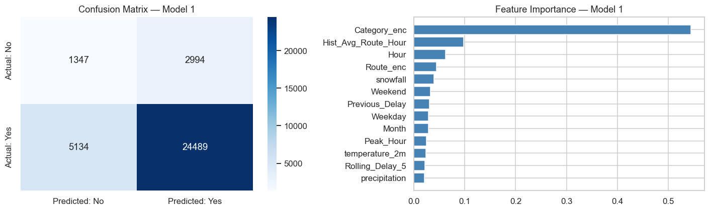

---

## Findings

- Subway delays are far more frequent but far shorter than bus delays. The 62.3% zero-delay rate for subway means most logged incidents did not hold a train at all, compared to only 8.5% zero-delay for bus.
- Bus incident volume grew from 58,301 in 2022 to 62,021 in 2025 (+6.4%), while average severity remained stable at 20–21 min, meaning total delay-minutes lost per year has grown and reached over 1.28 million minutes in 2025.
- Operations and Mechanical failures together account for over 55% of all bus incidents.
- For subway, the worst average delays are not at rush hour but at the 4–6 AM restart window, when there is no recovery buffer after overnight maintenance.
- Snow days increase total daily delay by +141% for bus and +478% for subway compared to normal days.
- The subway model (ROC-AUC 0.794) significantly outperforms the bus model (ROC-AUC 0.606), suggesting subway delays have more learnable structure tied to specific stations and delay codes.
- `Min Gap` was excluded from both models because it approximates `Min Delay + scheduled headway`, making it a direct proxy for the target variable that would not be available at prediction time.

---

## Modelling Notes

**Temporal split vs random split.**  
The three lag and rolling features use data from prior rows. A random split would allow 2025 rows to appear in the training set alongside 2022 rows in the test set, leaking future context into training. The temporal split ensures the model is always evaluated on data strictly later than what it trained on.

**Two separate dataframes.**  
`df` contains all rows including extreme outliers and is used for the Power BI export with the `Is_Outlier` flag. `df_model` has outliers removed and is used only for XGBoost training. This distinction ensures the Power BI export is a complete record of all real events while the model trains on a distribution that reflects ordinary service conditions.

**Why 3×IQR instead of 1.5×IQR**  
The subway median is 0 minutes, meaning 1.5×IQR would flag any delay around 12 minutes and remove a significant portion of valid delay signal. 3×IQR was chosen as a more conservative threshold that captures only the most extreme cases, setting the fence at 16 minutes.

---

## Power BI Dashboards

| Dashboard | Link |
|---|---|
| Bus Delay Dashboard | [View Dashboard](#) |
| Subway Delay Dashboard | [View Dashboard](#) |

---

## Tools Used

| Tool | Purpose |
|---|---|
| Python (pandas, numpy) | Data cleaning and feature engineering |
| XGBoost, scikit-learn | Classification modelling |
| Matplotlib, Seaborn | Visualisation |
| Open-Meteo Archive API | Historical hourly weather data |
| Power BI | Interactive dashboard |
